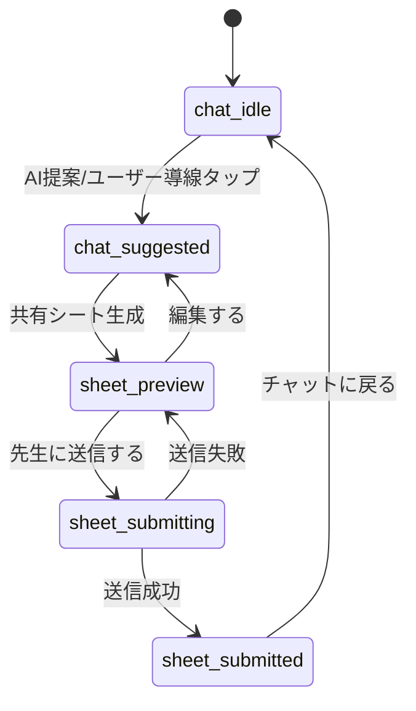

# チャット共有シート フロー仕様（StudentFlow / TeacherScreens）

`docs/plus-design-mobile.jsx` の `StudentFlow` / `TeacherScreens` を基準に、
フロント実装と API の最小スキーマを合わせるための仕様を定義する。

---

## 1. 画面・状態の列挙と型定義

### 1-1. StudentFlow の状態

| state | 説明 | 主なUI |
|---|---|---|
| `chat_idle` | 通常チャット中 | 入力欄のみ（共有シート導線は通常表示） |
| `chat_suggested` | AIが共有を提案 | 入力欄下の共有シート導線を強調表示 |
| `sheet_preview` | 共有シートの確認 | 「先生に送信する」「編集する」 |
| `sheet_submitting` | 送信中 | ボタンローディング（実装時） |
| `sheet_submitted` | 送信完了 | 完了メッセージと「チャットに戻る」 |

### 1-2. TeacherScreens の状態

| state | 説明 | 主なUI |
|---|---|---|
| `teacher_list` | 生徒一覧表示 | 新着ドット + 生徒カード一覧 |
| `teacher_detail_unread` | 新着シート詳細 | 新着バッジ表示 |
| `teacher_detail_read` | 既読シート詳細 | 新着バッジ非表示 |

### 1-3. 主要フラグ・ステータス型

```ts
export type ChatFlowState =
  | "chat_idle"
  | "chat_suggested"
  | "sheet_preview"
  | "sheet_submitting"
  | "sheet_submitted";

export type TeacherFlowState =
  | "teacher_list"
  | "teacher_detail_unread"
  | "teacher_detail_read";

export type SheetStatus = "draft" | "preview" | "submitted" | "read";
export type SubmissionStatus = "idle" | "ready" | "submitting" | "succeeded" | "failed";

/** Teacher list item の新着フラグ */
export type IsNew = boolean;

/** 入力欄下の共有シート導線の強調フラグ */
export type Highlight = "normal" | "emphasized";
```

> 実体の型定義は `src/types/chatSheetFlow.ts` を正とする。

---

## 2. 遷移図と戻る操作のルール

### 2-1. 遷移図（チャット→共有シート生成→プレビュー→送信完了）



### 2-2. 戻る操作時の挙動（下書き保持/破棄）

- `sheet_preview` → `chat_*` に戻る場合: **下書きを保持**（`sheetStatus: "draft"`）。
- `sheet_submitted` 到達後: **直近送信済みシートは保持**（再編集不可、閲覧のみ）。
- `sheet_submitting` 中の戻る: **不可**（二重送信/不整合防止）。
- ユーザーが明示的に「破棄」を選んだ場合のみ下書き削除（今後UI追加想定）。

---

## 3. 先生一覧の並び順と既読化ルール

### 3-1. 並び順

1. `isNew === true` を先頭にまとめる（**新着優先**）。
2. 同じ新着グループ内では `submittedAt` 降順（**新しい時系列順**）。
3. `isNew === false` グループも `submittedAt` 降順。
4. 同時刻は `studentId` 昇順で安定ソート。

擬似コード:

```ts
sort by (isNew desc, submittedAt desc, studentId asc)
```

### 3-2. 既読化ルール

- `teacher_detail_unread` を開いた時点で既読 API を発火（楽観更新可）。
- 既読成功後、一覧の `isNew` を `false` に更新。
- 既読 API 失敗時は一覧上の `isNew` をロールバック。
- 既読はシート単位（生徒単位ではない）。

---

## 4. APIレスポンス最小スキーマ（student / sheet / message）

```ts
// student
export interface Student {
  id: string;
  name: string;
  className: string; // 例: "3年1組"
}

// message
export interface Message {
  id: string;
  role: "student" | "assistant" | "teacher" | "system";
  text: string;
  createdAt: string; // ISO8601
}

// sheet
export interface Sheet {
  id: string;
  studentId: string;
  title: string;
  summary: {
    targetField: string;
    currentScore: string;
    concern: string;
    aiInsight: string;
  };
  sheetStatus: "draft" | "preview" | "submitted" | "read";
  submissionStatus: "idle" | "ready" | "submitting" | "succeeded" | "failed";
  isNew: boolean;
  submittedAt?: string; // ISO8601
  readAt?: string; // ISO8601
  sourceMessageIds: string[];
}
```

### 4-1. 画面同期で必要な最小レスポンス例

```json
{
  "student": {
    "id": "stu_001",
    "name": "青木 太郎",
    "className": "3年1組"
  },
  "sheet": {
    "id": "sheet_001",
    "studentId": "stu_001",
    "title": "情報系学部の志望校選び",
    "summary": {
      "targetField": "情報系学部（国公立 or 私立で検討中）",
      "currentScore": "数学 偏差値58 / 英語 偏差値52",
      "concern": "国公立を目指すか私立に絞るかの判断軸。英語の対策時期。",
      "aiInsight": "数学が強みで情報系は適性あり。英語は早期対策を推奨。"
    },
    "sheetStatus": "submitted",
    "submissionStatus": "succeeded",
    "isNew": true,
    "submittedAt": "2026-01-10T10:00:00Z",
    "sourceMessageIds": ["msg_101", "msg_102"]
  },
  "messages": [
    {
      "id": "msg_101",
      "role": "student",
      "text": "情報系の学部に行きたいです",
      "createdAt": "2026-01-10T09:42:00Z"
    },
    {
      "id": "msg_102",
      "role": "assistant",
      "text": "数学が強みですね。共有シートで先生に相談できます。",
      "createdAt": "2026-01-10T09:43:00Z"
    }
  ]
}
```

---

## 5. イベント計測仕様（InputC相当）

### 5-1. 必須イベント定義

InputC 相当の導線として、以下3イベントを必須とする。

| event_name | 発火タイミング | 主目的 |
|---|---|---|
| `sheet_create_click` | 「共有シートを作成」をクリック | 生成導線のCTR把握 |
| `sheet_preview_reached` | プレビュー画面が表示された瞬間 | 生成成功率・到達率把握 |
| `sheet_submit_completed` | 送信API成功レスポンス受領 | 送信完了率把握 |

### 5-2. 共通イベント属性

全イベントに以下の共通属性を付与する。

- `user_role`: `student` / `teacher`
- `school_id`: 学校ID
- `student_id`: 生徒ID（先生イベントは対象生徒IDを送る）
- `session_id`: チャットセッションID
- `sheet_id`: シートID（クリック時に未生成なら `null`）
- `event_at`: ISO8601（UTC）
- `ab_variant`: `control_button` / `integrated_link`

### 5-3. 表示コンテキスト属性（CTR比較用）

AI提案直後ハイライトと通常表示を比較するため、`display_context` を必須化する。

- `display_context`: `ai_suggestion_highlight` / `default`
- `suggestion_source`: `assistant_auto` / `manual_open`
- `ui_surface`: `chat_input_footer`

CTR計算例:

- 分子: `sheet_create_click`
- 分母: `sheet_entry_impression`
- 比較軸: `display_context`

> 補足: CTRを正確に比較するため、露出イベント `sheet_entry_impression` も同一属性で実装する。

### 5-4. 実装例（イベントペイロード）

```json
{
  "event_name": "sheet_create_click",
  "user_role": "student",
  "school_id": "sch_001",
  "student_id": "stu_001",
  "session_id": "ses_123",
  "sheet_id": null,
  "ab_variant": "integrated_link",
  "display_context": "ai_suggestion_highlight",
  "suggestion_source": "assistant_auto",
  "ui_surface": "chat_input_footer",
  "event_at": "2026-03-20T09:00:00Z"
}
```

---

## 6. KPIダッシュボード設計（生徒側 / 先生側）

### 6-1. 生徒側KPI

| KPI | 定義 | 推奨集計粒度 |
|---|---|---|
| 作成率 | `sheet_preview_reached UU / sheet_entry_impression UU` | 日次・週次 |
| 送信率 | `sheet_submit_completed UU / sheet_preview_reached UU` | 日次・週次 |
| 離脱率 | `1 - (sheet_submit_completed UU / sheet_create_click UU)` | 日次・週次 |

### 6-2. 先生側KPI

| KPI | 定義 | 推奨集計粒度 |
|---|---|---|
| 閲覧率 | `teacher_sheet_opened UU / sheet_submit_completed UU` | 日次・週次 |
| コメント返却率 | `teacher_comment_returned UU / teacher_sheet_opened UU` | 日次・週次 |

### 6-3. ダッシュボードの最小要件

- フィルタ: 期間、学校、学年、AB variant
- 分解軸: `display_context`（highlight / default）
- ファネル表示（生徒）:
  1. `sheet_entry_impression`
  2. `sheet_create_click`
  3. `sheet_preview_reached`
  4. `sheet_submit_completed`
- 先生側遷移:
  1. `sheet_submit_completed`
  2. `teacher_sheet_opened`
  3. `teacher_comment_returned`
- アラート例:
  - 送信率が7日移動平均で前週比 -10% 超
  - コメント返却率が 40% 未満

---

## 7. ABテスト計画（2〜4週間）

### 7-1. 目的と比較条件

- 目的: 共有シート導線を「現状ボタン」から「統合リンク」へ変更した際の行動改善検証
- 対照群（A）: 現状ボタン（`control_button`）
- 実験群（B）: 統合リンク（`integrated_link`）

### 7-2. 実施期間・配分

- 期間: 最短2週間、最大4週間
- 割当: 50:50（学校単位 or ユーザー単位で固定割当）
- 停止条件:
  - 主要KPIの有意差が事前基準到達
  - 4週間到達
  - 異常値（重大バグ/CS障害）検知で一時停止

### 7-3. 評価指標（主要/副次）

- 主要指標（Primary）:
  - `sheet_submit_completed UU / sheet_entry_impression UU`（最終送信到達率）
- 副次指標（Secondary）:
  - CTR: `sheet_create_click / sheet_entry_impression`
  - プレビュー到達率: `sheet_preview_reached / sheet_create_click`
  - 先生閲覧率: `teacher_sheet_opened / sheet_submit_completed`
  - 先生コメント返却率: `teacher_comment_returned / teacher_sheet_opened`

### 7-4. 事前採用判断基準（Go/No-Go）

リリース前に以下を明文化し、途中変更しない。

1. **採用（Go）**
   - B群の主要指標が A群比で **+8%以上改善**
   - かつ、生徒離脱率が悪化しない（A群比 +2pt 以内）
   - かつ、先生コメント返却率が悪化しない（A群比 -2pt 以内）
2. **保留（Iterate）**
   - 主要指標改善が +3%〜+8% 未満、または副次指標にトレードオフあり
3. **不採用（No-Go）**
   - 主要指標が +3% 未満、または離脱率が +2pt 超悪化

### 7-5. 実行チェックリスト

- [ ] 計測イベントの欠損率 < 1%
- [ ] AB割当の偏り（学校/学年）なし
- [ ] 主要KPIの定義をSQL/BI上で固定
- [ ] 週次で中間レビュー（第1週末・第2週末）
- [ ] 最終レポートに「採用判断」「リスク」「次アクション」を明記

