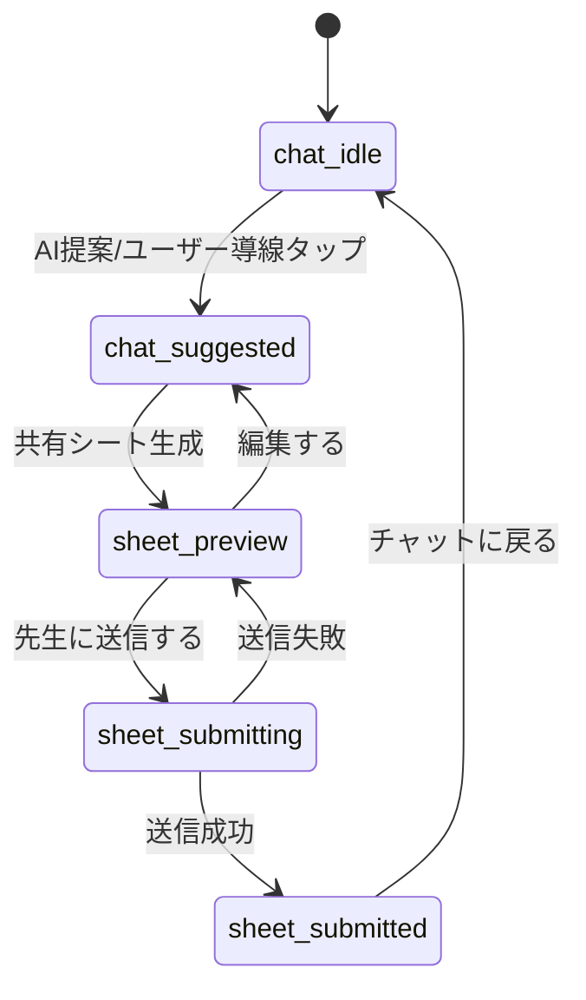

# チャット共有シート フロー仕様（StudentFlow / TeacherScreens）

`docs/plus-design-mobile.jsx` の `StudentFlow` / `TeacherScreens` を基準に、
フロント実装と API の最小スキーマを合わせるための仕様を定義する。

---

## 1. 画面・状態の列挙と型定義

### 1-1. StudentFlow の状態

| state | 説明 | 主なUI |
|---|---|---|
| `chat_idle` | 通常チャット中 | 入力欄のみ（共有シート導線は通常表示） |
| `chat_suggested` | AIが共有を提案 | 入力欄下の共有シート導線を強調表示 |
| `sheet_preview` | 共有シートの確認 | 「先生に送信する」「編集する」 |
| `sheet_submitting` | 送信中 | ボタンローディング（実装時） |
| `sheet_submitted` | 送信完了 | 完了メッセージと「チャットに戻る」 |

### 1-2. TeacherScreens の状態

| state | 説明 | 主なUI |
|---|---|---|
| `teacher_list` | 生徒一覧表示 | 新着ドット + 生徒カード一覧 |
| `teacher_detail_unread` | 新着シート詳細 | 新着バッジ表示 |
| `teacher_detail_read` | 既読シート詳細 | 新着バッジ非表示 |

### 1-3. 主要フラグ・ステータス型

```ts
export type ChatFlowState =
  | "chat_idle"
  | "chat_suggested"
  | "sheet_preview"
  | "sheet_submitting"
  | "sheet_submitted";

export type TeacherFlowState =
  | "teacher_list"
  | "teacher_detail_unread"
  | "teacher_detail_read";

export type SheetStatus = "draft" | "preview" | "submitted" | "read";
export type SubmissionStatus = "idle" | "ready" | "submitting" | "succeeded" | "failed";

/** Teacher list item の新着フラグ */
export type IsNew = boolean;

/** 入力欄下の共有シート導線の強調フラグ */
export type Highlight = "normal" | "emphasized";
```

> 実体の型定義は `src/types/chatSheetFlow.ts` を正とする。

---

## 2. 遷移図と戻る操作のルール

### 2-1. 遷移図（チャット→共有シート生成→プレビュー→送信完了）



### 2-2. 戻る操作時の挙動（下書き保持/破棄）

- `sheet_preview` → `chat_*` に戻る場合: **下書きを保持**（`sheetStatus: "draft"`）。
- `sheet_submitted` 到達後: **直近送信済みシートは保持**（再編集不可、閲覧のみ）。
- `sheet_submitting` 中の戻る: **不可**（二重送信/不整合防止）。
- ユーザーが明示的に「破棄」を選んだ場合のみ下書き削除（今後UI追加想定）。

---

## 3. 先生一覧の並び順と既読化ルール

### 3-1. 並び順

1. `isNew === true` を先頭にまとめる（**新着優先**）。
2. 同じ新着グループ内では `submittedAt` 降順（**新しい時系列順**）。
3. `isNew === false` グループも `submittedAt` 降順。
4. 同時刻は `studentId` 昇順で安定ソート。

擬似コード:

```ts
sort by (isNew desc, submittedAt desc, studentId asc)
```

### 3-2. 既読化ルール

- `teacher_detail_unread` を開いた時点で既読 API を発火（楽観更新可）。
- 既読成功後、一覧の `isNew` を `false` に更新。
- 既読 API 失敗時は一覧上の `isNew` をロールバック。
- 既読はシート単位（生徒単位ではない）。

---

## 4. APIレスポンス最小スキーマ（student / sheet / message）

```ts
// student
export interface Student {
  id: string;
  name: string;
  className: string; // 例: "3年1組"
}

// message
export interface Message {
  id: string;
  role: "student" | "assistant" | "teacher" | "system";
  text: string;
  createdAt: string; // ISO8601
}

// sheet
export interface Sheet {
  id: string;
  studentId: string;
  title: string;
  summary: {
    targetField: string;
    currentScore: string;
    concern: string;
    aiInsight: string;
  };
  sheetStatus: "draft" | "preview" | "submitted" | "read";
  submissionStatus: "idle" | "ready" | "submitting" | "succeeded" | "failed";
  isNew: boolean;
  submittedAt?: string; // ISO8601
  readAt?: string; // ISO8601
  sourceMessageIds: string[];
}
```

### 4-1. 画面同期で必要な最小レスポンス例

```json
{
  "student": {
    "id": "stu_001",
    "name": "青木 太郎",
    "className": "3年1組"
  },
  "sheet": {
    "id": "sheet_001",
    "studentId": "stu_001",
    "title": "情報系学部の志望校選び",
    "summary": {
      "targetField": "情報系学部（国公立 or 私立で検討中）",
      "currentScore": "数学 偏差値58 / 英語 偏差値52",
      "concern": "国公立を目指すか私立に絞るかの判断軸。英語の対策時期。",
      "aiInsight": "数学が強みで情報系は適性あり。英語は早期対策を推奨。"
    },
    "sheetStatus": "submitted",
    "submissionStatus": "succeeded",
    "isNew": true,
    "submittedAt": "2026-01-10T10:00:00Z",
    "sourceMessageIds": ["msg_101", "msg_102"]
  },
  "messages": [
    {
      "id": "msg_101",
      "role": "student",
      "text": "情報系の学部に行きたいです",
      "createdAt": "2026-01-10T09:42:00Z"
    },
    {
      "id": "msg_102",
      "role": "assistant",
      "text": "数学が強みですね。共有シートで先生に相談できます。",
      "createdAt": "2026-01-10T09:43:00Z"
    }
  ]
}
```

